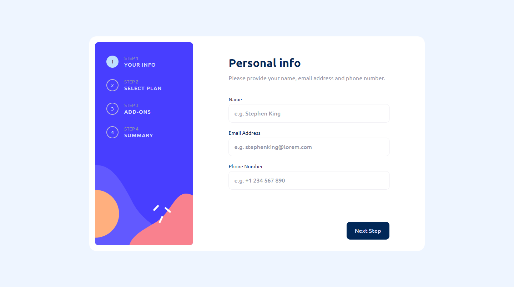
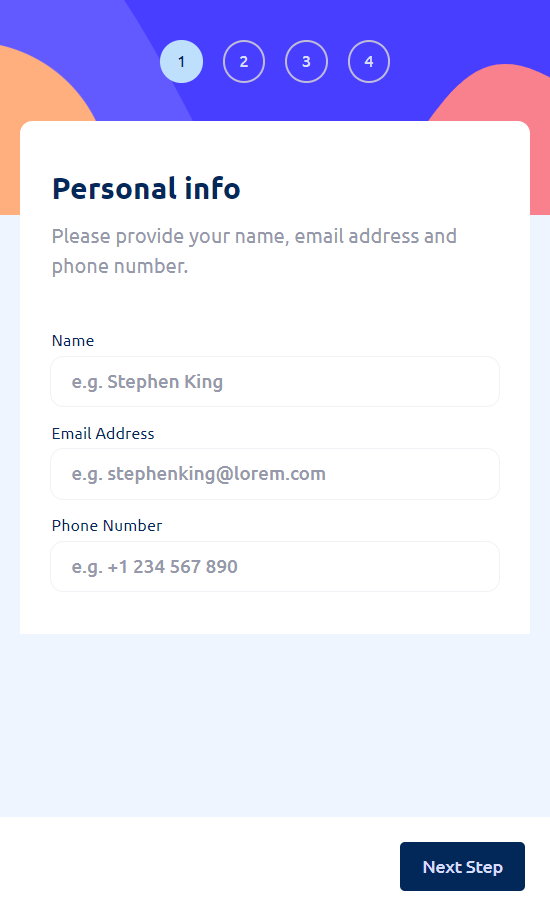

# Multi-step Form

This is a solution to the [Multi-step form challenge on Frontend Mentor](https://www.frontendmentor.io/challenges/multistep-form-YVAnSdqQBJ). Frontend Mentor challenges help you improve your coding skills by building realistic projects.

## Table of contents

- [Screenshots](#screenshots)
- [Features](#features)
- [Links](#links)
- [Built with](#built-with)

## Screenshots

Desktop view (1440px)

Mobile view (440px)

## Features

Users should be able to:

- Complete each step of the sequence
- Go back to a previous step to update their selections
- See a summary of their selections on the final step and confirm their order
- View the optimal layout for the interface depending on their device's screen size
- See hover and focus states for all interactive elements on the page
- Receive form validation messages if:
  - A field has been missed
  - The email address is not formatted correctly
  - A step is submitted, but no selection has been made

  ## Links

  - Live site URL => https://multi-step-form-km.netlify.app

  ## Built with

  - Angular (v18.2.2)
  - SCSS